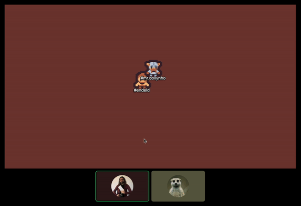
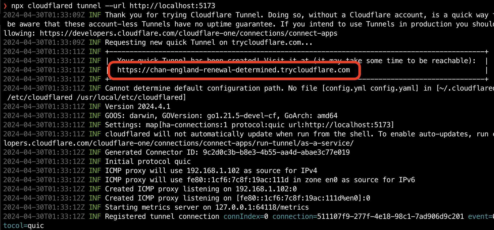

# (Template) Colyseus + Discord Embedded App SDK

This Project Template is a starting point for crafting HTML5 multiplayer Discord Activities.



## Project Structure

This repository contains the front-end and back-end are separated into two different projects.

- `client/` - Has the frontend project, using Pixi.js and Vite
- `server/` - Has the backend project, using Colyseus (Node.js)

The `client` development server (`vite`) proxies the `/api` requests to the `server` project. This mimics the production setup where the `client` and `server` are deployed separately, and the `client` communicates with the `server` via the `/api` prefix (mapped to your deployed `server` URL via Discord's "URL Mappings").

## Environment variables

Both the `client` and `server` projects need environment variables configured from your Discord Activity.

- `client/.env` - Should contain your "OAuth2 → Client ID" under `VITE_DISCORD_CLIENT_ID`.
- `server/.env` - Should contain your "OAuth2 → Client ID" under `DISCORD_CLIENT_ID` and "OAuth2 → Client Secret" under `DISCORD_CLIENT_SECRET`.


---

## Testing your local Discord Activity

In order to test your Discord Activity locally, you need to expose your local server to the public internet.

We will need to open 3 terminal windows to run the server, client, and the `cloudflared` tunnel.

1. Start the server

```
cd server
npm install
npm start
```

2. Start the client

```
cd client
npm install
npm start
```

3. Expose your local server to the public internet _(as described [here](https://discord.com/developers/docs/activities/building-an-activity#step-4-running-your-app-locally-in-discord))._

During development, there's no need to expose the `server` to the public internet - only the `client`. Our Vite development server proxies the `/api` requests to our local server.

```
cd client
npx cloudflared tunnel --url http://localhost:5173
```



You will need to update your Discord Activity's "OAuth2 → Redirect URL" and "URL Mappings → Target" to the URL provided by `cloudflared`:

<p float="left">
  
  
</p>

> [!WARNING]
> Each time you run `cloudflared`, it will generate a new URL. Be sure to update your Discord Activity's "OAuth2 → Redirect URL" and "URL Mappings → Target" to the new URL.

_(Be sure to complete all the steps listed [here](https://discord.com/developers/docs/activities/building-an-activity) to ensure your development setup is working as expected.)_

---

## Deploying your Discord Activity

When deploying your Discord Activity, you will generally need to deploy the `client` and `server` projects separately, under their own public URLs.

> [!TIP]
> You can use services like Vercel, Netlify, or Heroku to deploy your client project, and services like [Colyseus Cloud](https://colyseus.io/cloud-managed-hosting/), [Vultr](https://www.vultr.com/marketplace/apps/colyseus/?ref=8013231), AWS, or DigitalOcean to deploy your server project.

You will need to configure your Discord Activity's URLs:

- "OAuth2 → Redirect URL" to point to your deployed **client** project.
- "URL Mappings → Root Mapping / Target" to point to your deployed **client** project.
- "URL Mappings → Prefix `/api` / Target" to point to your deployed **server** project.

---

## More Discord Activities (open source)

> Made a cool Discord Activity? Make a pull-request and contribute to the list below!

- Discord Typing Race - [linkai101/keyboard-derby](https://github.com/linkai101/keyboard-derby/)
- TypeScript + Colyseus + React - [Wave-Play/robo.js](https://github.com/Wave-Play/robo.js/tree/main/templates/activity-ts-colyseus-react)
- [Creating Discord Games with Phaser](https://phaser.io/tutorials/creating-discord-games-with-phaser) - describes the steps required to create a Discord App and get a Phaser game running as a Discord Activity. (Does not use Colyseus, but can be adapted to do so.)

## License

MIT
